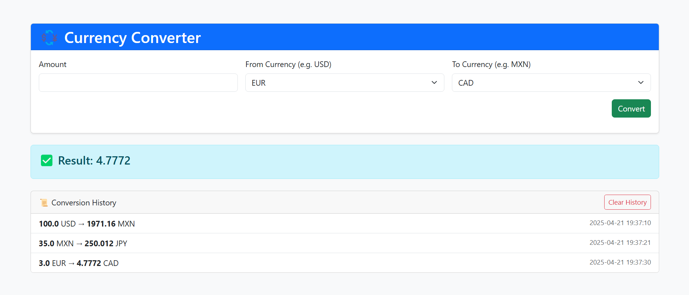

# 💱 Currency Converter – Spring MVC

A simple currency converter built using **Spring Framework (non-Boot)**, JSP, JSTL and Bootstrap 5.  
It allows users to convert between currencies using real-time data from the ExchangeRate API.

 <!-- Puedes cambiar esto por una screenshot tuya -->

---

## ✨ Features

- 🔄 Real-time currency conversion
- 🧠 Intelligent form with dropdown selection
- 📜 Conversion history stored in session
- 🧹 Clear session/history button
- 🕒 Timestamp for each conversion
- 🎨 Clean and modern UI with Bootstrap 5

---

## 🚀 Tech Stack

- Java 8+
- Spring MVC (Spring Web MVC 5)
- JSP + JSTL
- Maven
- Tomcat 9
- Bootstrap 5

---

## 📷 Demo

```text
100 USD → 1702.63 MXN          [2025-04-21 20:32:11]
50 EUR  → 54.87 USD            [2025-04-21 20:34:22]
```

## 🙋‍♂️ About Me
**Angel Gael Aviles Gama**  
[LinkedIn](https://www.linkedin.com/in/angelavilesgama)  
[GitHub](https://github.com/temachtili)
